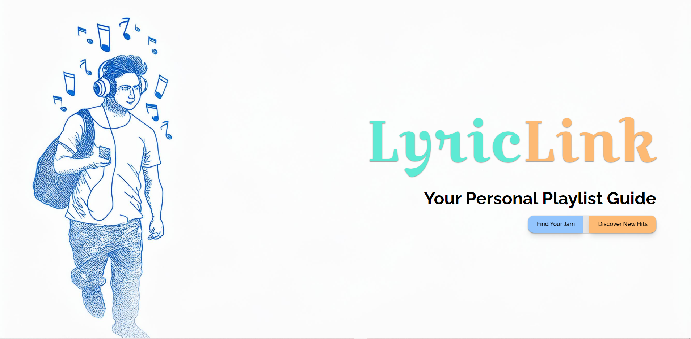
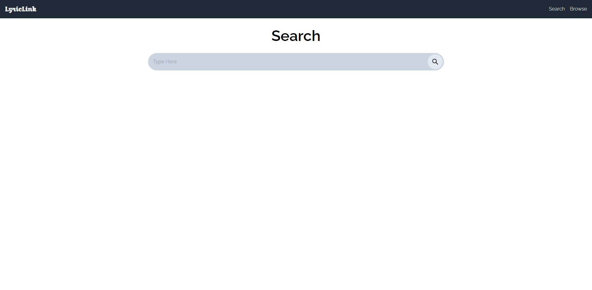
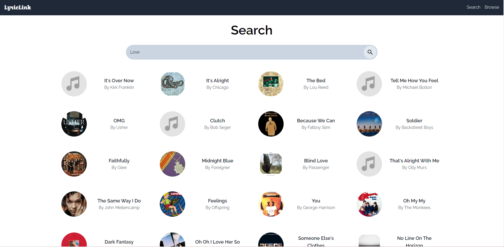
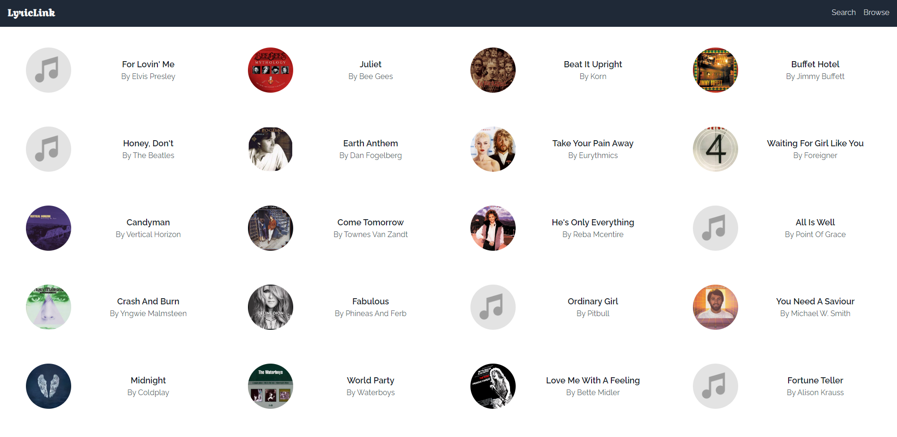
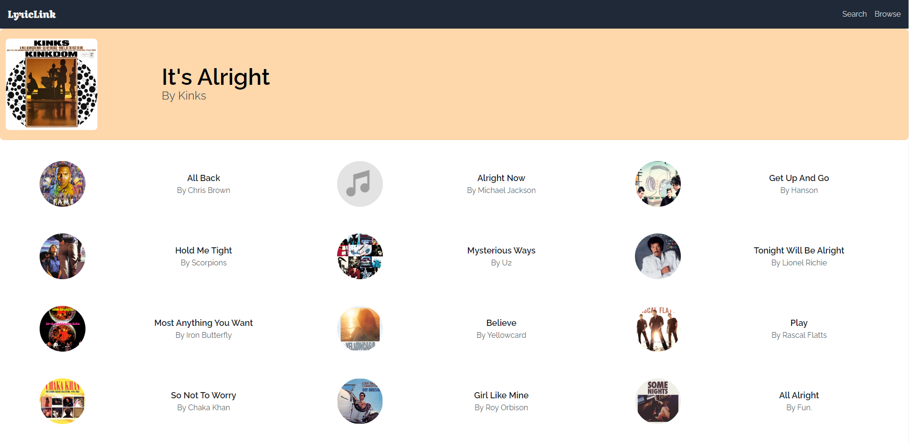

# Song Recommender

This project is a song recommender application that allows users to search for songs and receive recommendations based on their selections.

## Table of Contents

- [Technologies Used](#technologies-used)
- [Project Workflow](#project-workflow)
- [Project Structure](#project-structure)
- [Installation](#installation)
- [Usage](#usage)
- [Screenshots for Reference](#screenshots-for-reference)

## Technologies Used

- **Frontend:** React.js ([React.js](https://reactjs.org/))
- **Backend:** Python (using FastAPI for REST API and Uvicorn as the ASGI server) ([FastAPI](https://fastapi.tiangolo.com/tutorial/first-steps/), [Uvicorn](https://www.uvicorn.org/))
- **Deployment:** Docker ([Docker](https://docs.docker.com/engine/reference/builder/))

## Project Workflow

1. **Data Collection and Pre-processing:**

   - The project begins with the collection of song data, from Kaggle.
   - The collected data is pre-processed to clean and normalize the text, remove noise, and extract relevant features for subsequent analysis.

2. **Similarity Calculation:**

   - The model calculates similarity between songs using techniques such as TF-IDF vectorization and cosine similarity.
   - By comparing the lyrics of different songs, the model identifies songs that are most similar to each other and recommends them to users based on their preferences.

3. **Backend Development:**

   - The backend infrastructure is developed using the FastAPI framework, which provides a high-performance and asynchronous web server for handling API requests.
   - Endpoints are defined to support different functionalities, such as searching for songs, retrieving recommendations, and serving static assets to the frontend.

4. **Frontend Implementation:**

   - The frontend user interface is designed and implemented using React.js and TailwindCSS, with a focus on usability, responsiveness, and visual appeal.
   - Components are created to represent different elements of the application, such as search bars, song cards, and navigation menus.
   - API calls are made from the frontend to the backend endpoints to fetch and display song data, recommendations, and search results in real-time.

5. **Integration and Testing:**
   - The backend and frontend components are integrated to create a cohesive and functional application.

## Project Structure

This project uses a separation of concerns by dividing the codebase into a backend and frontend:

- **[python_backend/](python_backend/)** (Backend code)
  - **[ml_recommend/](python_backend/ml_recommend/)** (Machine Learning Recommendation logic)
    - **[recommender.ipynb](python_backend/ml_recommend/recommender.ipynb):** Jupyter Notebook file containing the core recommendation logic.
    - **[spotify_millsongdata.csv](python_backend/ml_recommend/spotify_millsongdata.csv):** CSV file containing song data.
  - **[Dockerfile](python_backend/Dockerfile):** Defines instructions for building a Docker image for the backend.
  - **[requirements.txt](python_backend/requirements.txt):** Text file containing dependency requirements for the backend project.
  - **[main.py](python_backend/main.py):** Likely the main entry point for the backend application.
  - **[data.pkl](python_backend/data.pkl):** A pickled data file used by the backend.
  - **[Song.py](python_backend/Song.py):** Python class definition for representing song data.
  - **[similarity_dict.pkl](python_backend/similarity_dict.pkl):** A pickled dictionary used for storing song similarities.
- **[frontend/](frontend/)** (Frontend code)
  - **[src/](frontend/src/)** (Source code directory)
    - **[index.js](frontend/src/index.js):** Main JavaScript entry point for the frontend application.
    - **[index.css](frontend/src/index.css):** Main CSS stylesheet for the frontend application.
    - **[components/](frontend/src/components/)** (Reusable UI components) - This directory contains reusable UI components for building the frontend interface.
    - **[App.js](frontend/src/App.js):** Main React component for the application.
    - **[App.css](frontend/src/App.css):** CSS styles specific to the App component.
  - **[public/](frontend/public/)** (Public assets directory)
    - **[robots.txt](frontend/public/robots.txt):** File instructing search engines how to crawl the website.
    - **[manifest.json](frontend/public/manifest.json):** Manifest file for web applications or Progressive Web Apps (PWAs).
    - **[logo512.png](frontend/public/logo512.png)** & **[logo192.png](frontend/public/logo192.png):** App icons in different sizes.
    - **[index.html](frontend/public/index.html):** Main HTML file for the frontend application.
    - **[favicon.ico](frontend/public/favicon.ico):** Favicon for the website.
  - **[tailwind.config.js](frontend/tailwind.config.js):** Configuration file for Tailwind CSS, a utility-first CSS framework (if used in the project).
  - **[package-lock.json](frontend/package-lock.json):** Lock file generated by npm/yarn to ensure consistent dependency versions.
  - **[package.json](frontend/package.json):** File containing project metadata, dependencies, and scripts for the frontend.
  - **[Dockerfile](frontend/Dockerfile):** Defines instructions for building a Docker image for the frontend.

## Installation

**Prerequisites:**

- Docker installed: [https://www.docker.com/products/docker-desktop/](https://www.docker.com/products/docker-desktop/)

**Instructions:**

1. Clone this repository:

   ```bash
   git clone https://github.com/prashant-singh-2001/song_recommender.git
   ```

2. Navigate to the project directory:

   ```bash
   cd song_recommender
   ```

3. Start the application:

   ```bash
   docker-compose up
   ```

4. Access the application:

   The application is likely accessible in your web browser at `http://localhost:<port>`, where `<port>` depends on how the ports are mapped in `docker-compose.yaml`. Typically, the front-end service might be exposed on port 3000, so you could try `http://localhost:3000`.

## Usage

- The application allows you to search for songs by name.
- Based on your search, the application will recommend similar songs.
- It also allows you to browse random songs.

## Screenshots for Reference

 </br>

### Landing Page

- By Clicking on 'Find Your Jam' button you can go to Search Page and search for your favorite songs.
- By clicking on 'Discover New Hits' button you can go to browse page and browse randomly selected songs.
<hr/>
<br/>
<br/>
 </br>

### Search Page

Type in any keyword and hit the search icon, it will search for songs that have keyword(s) in their lyrics.

<hr/>
<br/>
<br/>

 </br>

### Search Page with Results

- On clicking on any of the search results, you can go to its page and see the similarly recommended songs.
<hr/>
<br/>
<br/>
 </br>

### Browse Page

Browse through a list of randomly selected songs from our database.

<hr/>
<br/>
<br/>

 </br>

### Song Page

Here you can get the recommendations for similar songs to the selected one.
